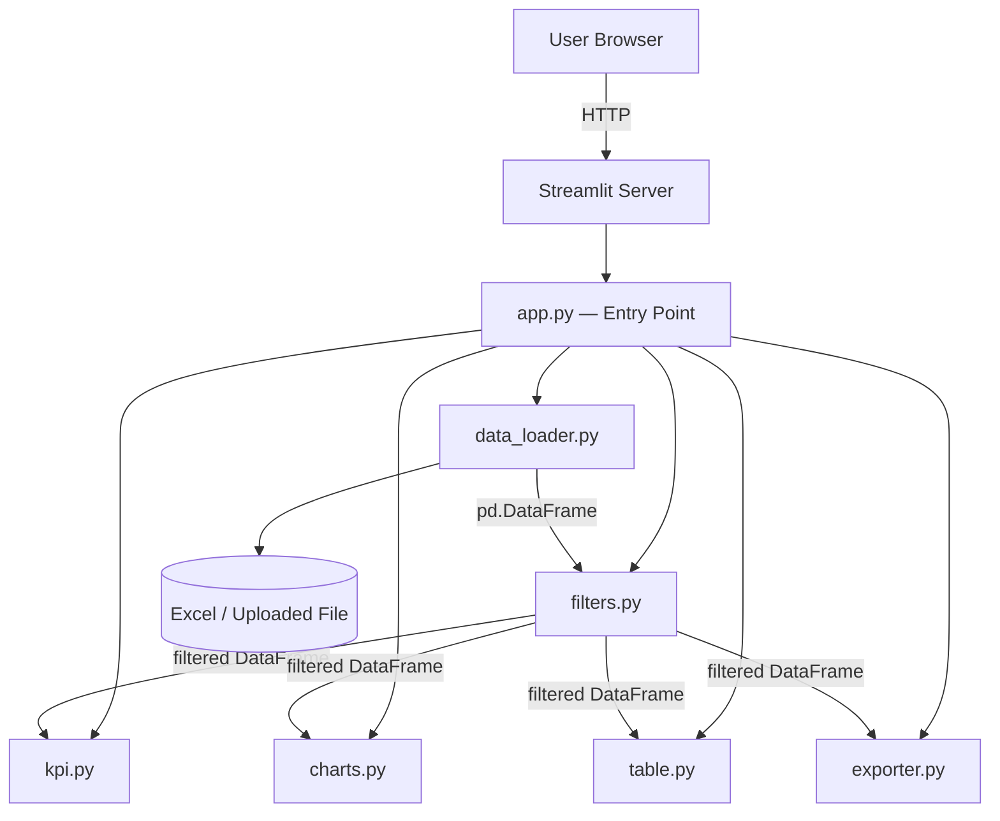
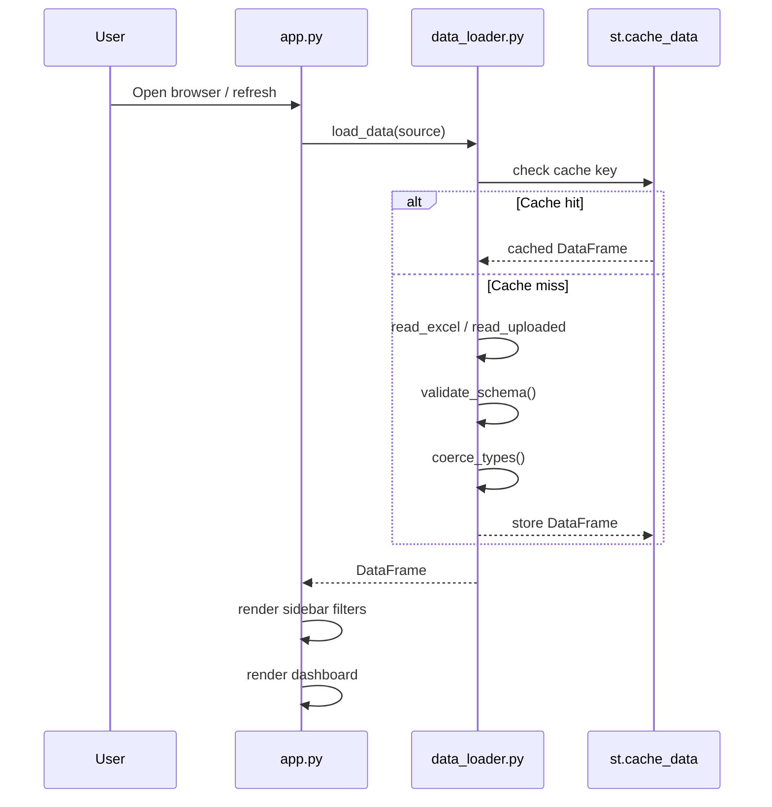
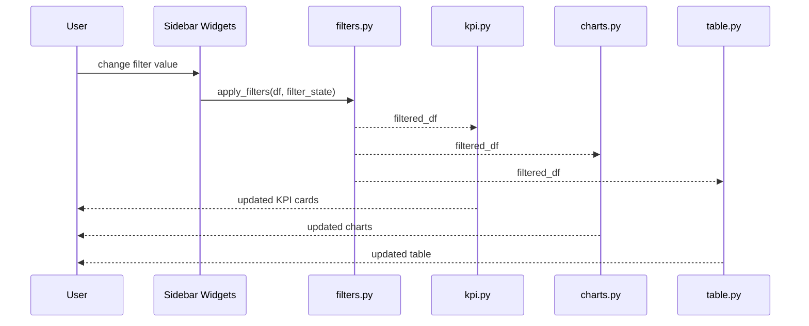
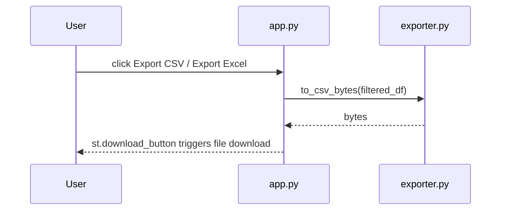

# Design Document: Dispatch & Delivery Reporting System

## Overview

A Streamlit-based interactive reporting dashboard that ingests a dispatch and delivery Excel file, provides multi-dimensional filtering, displays KPI summary cards and charts, renders a searchable data table, and allows export of filtered results to CSV or Excel.

The application is self-contained — users either upload a file at runtime or load a pre-configured file path — and requires no backend beyond the Streamlit process itself. All data processing is handled in-memory using pandas, and all visualisations are rendered with Plotly.

The system is designed around the known schema of `deliveries_dispatc_sample.xlsx` (93 rows × 14 columns) but is tolerant of additional rows and minor schema variations so it can be reused as new exports arrive.

---

## Architecture



### Module Responsibilities

| Module | Responsibility |
|---|---|
| `app.py` | Page layout, sidebar wiring, component orchestration |
| `data_loader.py` | File ingestion, schema validation, type coercion, caching |
| `filters.py` | Sidebar filter state → boolean mask → filtered DataFrame |
| `kpi.py` | Aggregate metrics computation and KPI card rendering |
| `charts.py` | All Plotly figure factories |
| `table.py` | Searchable, paginated data table rendering |
| `exporter.py` | CSV / Excel byte-stream generation for `st.download_button` |

---

## Sequence Diagrams

### App Startup & Data Load



### Filter → Render Cycle



### Export Flow



---

## Components and Interfaces

### Component 1: DataLoader (`data_loader.py`)

**Purpose**: Ingest the Excel file from a file path or an `UploadedFile` object, validate the schema, coerce types, and return a clean DataFrame.

**Interface**:
```python
def load_data(source: str | UploadedFile) -> pd.DataFrame:
    """Load and validate the delivery Excel file.
    
    Args:
        source: Absolute file path string OR Streamlit UploadedFile object.
    
    Returns:
        Validated, type-coerced DataFrame with canonical column names.
    
    Raises:
        SchemaValidationError: If required columns are missing.
        DataLoadError: If the file cannot be read.
    """

def validate_schema(df: pd.DataFrame) -> None:
    """Assert all required columns are present."""

def coerce_types(df: pd.DataFrame) -> pd.DataFrame:
    """Parse dates, cast numerics, strip whitespace from strings."""
```

**Responsibilities**:
- Accept both file path and Streamlit `UploadedFile`
- Cache result with `@st.cache_data` keyed on file hash / mtime
- Parse `Status Updated On` as `datetime` (format `%d/%m/%Y`)
- Cast `COD Amount`, `Charge`, `Discount` to numeric (coerce errors → 0)
- Strip leading/trailing whitespace from all string columns
- Raise typed exceptions on schema mismatch

---

### Component 2: Filters (`filters.py`)

**Purpose**: Read sidebar widget state and produce a filtered DataFrame.

**Interface**:
```python
@dataclass
class FilterState:
    stores: list[str]           # selected store names; empty = all
    statuses: list[str]         # selected delivery statuses; empty = all
    payment_statuses: list[str] # selected payment statuses; empty = all
    date_from: date | None
    date_to: date | None
    search_text: str            # free-text search across Consignment ID / Recipient Name

def render_sidebar_filters(df: pd.DataFrame) -> FilterState:
    """Render all sidebar widgets and return current filter state."""

def apply_filters(df: pd.DataFrame, state: FilterState) -> pd.DataFrame:
    """Apply FilterState to df and return filtered copy."""
```

**Responsibilities**:
- Derive filter option lists dynamically from the loaded DataFrame (no hardcoded values)
- "Select All" default for multi-select filters
- Date range defaults to full extent of data
- Free-text search is case-insensitive substring match on `Consignment ID` and `Recipient Name`
- Return empty DataFrame (not error) when filters produce zero rows

---

### Component 3: KPI (`kpi.py`)

**Purpose**: Compute aggregate metrics and render KPI cards in a responsive column layout.

**Interface**:
```python
@dataclass
class KPIMetrics:
    total_parcels: int
    total_cod: float
    total_charges: float
    total_discounts: float
    net_revenue: float          # total_charges - total_discounts
    pending_count: int
    pickup_requested_count: int

def compute_kpis(df: pd.DataFrame) -> KPIMetrics:
    """Compute all KPI values from filtered DataFrame."""

def render_kpi_cards(metrics: KPIMetrics) -> None:
    """Render KPI metric cards using st.metric in a 4-column layout."""
```

**Responsibilities**:
- Handle empty DataFrame gracefully (all metrics = 0)
- Format currency values with comma separators (e.g. ৳1,747)
- Display delta indicators where meaningful (e.g. pending vs. total)

---

### Component 4: Charts (`charts.py`)

**Purpose**: Factory functions that return Plotly figures for each chart type.

**Interface**:
```python
def delivery_status_pie(df: pd.DataFrame) -> go.Figure:
    """Pie/donut chart of parcel count by Delivery Status."""

def store_distribution_bar(df: pd.DataFrame) -> go.Figure:
    """Horizontal bar chart of parcel count by Store."""

def cod_amount_histogram(df: pd.DataFrame) -> go.Figure:
    """Histogram of COD Amount distribution."""

def daily_trend_line(df: pd.DataFrame) -> go.Figure:
    """Line chart of parcel count grouped by Status Updated On date."""
```

**Responsibilities**:
- Return `go.Figure` objects (not render directly) to keep rendering in `app.py`
- Use consistent colour palette across all charts
- Handle empty DataFrame by returning a figure with a "No data" annotation
- All figures must be responsive (`use_container_width=True` at call site)

---

### Component 5: Table (`table.py`)

**Purpose**: Render a searchable, column-sortable data table with pagination.

**Interface**:
```python
def render_data_table(df: pd.DataFrame) -> None:
    """Render interactive data table with column config and pagination."""
```

**Responsibilities**:
- Use `st.dataframe` with `column_config` for formatted display (currency columns, date columns)
- Show row count above the table
- Highlight rows where `Delivery Status == "Pending"` via conditional formatting
- Limit default visible columns; allow user to expand

---

### Component 6: Exporter (`exporter.py`)

**Purpose**: Convert a DataFrame to downloadable bytes for CSV or Excel.

**Interface**:
```python
def to_csv_bytes(df: pd.DataFrame) -> bytes:
    """Encode DataFrame as UTF-8 CSV bytes."""

def to_excel_bytes(df: pd.DataFrame) -> bytes:
    """Encode DataFrame as .xlsx bytes using openpyxl engine."""
```

**Responsibilities**:
- CSV: UTF-8 with BOM for Excel compatibility
- Excel: single sheet named "Filtered Data", auto-fit column widths
- Both functions must be pure (no side effects, no `st.*` calls)

---

## Data Models

### Model 1: Raw Delivery Record (as loaded from Excel)

```python
@dataclass
class DeliveryRecord:
    consignment_id: str       # e.g. "DD240526PX5B4X"
    type: str                 # always "Parcel"
    order_id: str
    store: str                # one of 4 known stores
    recipient_name: str
    address: str
    phone: int
    delivery_status: str      # "Pending" | "Waiting for Pickup" | "Pickup Requested" | "Pickup On Hold"
    status_updated_on: date   # parsed from "dd/mm/yyyy"
    cod_amount: float         # 0–5928
    charge: float             # 50–149
    discount: float           # 10–50
    payment_status: str       # "Unpaid" in current data
    action: str               # "View, POD"
```

**Validation Rules**:
- `consignment_id` must be non-empty string
- `cod_amount`, `charge`, `discount` must be non-negative numbers
- `status_updated_on` must be parseable as a date
- `delivery_status` must be one of the 4 known values (warn, don't error, on unknown values)

### Model 2: FilterState (see filters.py above)

### Model 3: KPIMetrics (see kpi.py above)

---

## Algorithmic Pseudocode

### Main Application Flow

```pascal
PROCEDURE run_app()
  SEQUENCE
    st.set_page_config(title="Dispatch & Delivery Report", layout="wide")
    
    // Step 1: File source selection
    source ← render_file_source_selector()
    
    IF source IS NULL THEN
      st.info("Please upload or select a file to begin.")
      RETURN
    END IF
    
    // Step 2: Load data
    TRY
      df ← load_data(source)
    CATCH DataLoadError AS e
      st.error(e.message)
      RETURN
    CATCH SchemaValidationError AS e
      st.error("File schema mismatch: " + e.message)
      RETURN
    END TRY
    
    // Step 3: Sidebar filters
    filter_state ← render_sidebar_filters(df)
    filtered_df ← apply_filters(df, filter_state)
    
    // Step 4: KPI section
    metrics ← compute_kpis(filtered_df)
    render_kpi_cards(metrics)
    
    // Step 5: Charts section (2-column layout)
    col1, col2 ← st.columns(2)
    col1.plotly_chart(delivery_status_pie(filtered_df))
    col2.plotly_chart(store_distribution_bar(filtered_df))
    col1.plotly_chart(cod_amount_histogram(filtered_df))
    col2.plotly_chart(daily_trend_line(filtered_df))
    
    // Step 6: Data table
    render_data_table(filtered_df)
    
    // Step 7: Export buttons
    csv_bytes ← to_csv_bytes(filtered_df)
    excel_bytes ← to_excel_bytes(filtered_df)
    st.download_button("Export CSV", csv_bytes, "deliveries.csv")
    st.download_button("Export Excel", excel_bytes, "deliveries.xlsx")
  END SEQUENCE
END PROCEDURE
```

**Preconditions:**
- Streamlit runtime is active
- Python environment has `streamlit`, `pandas`, `plotly`, `openpyxl` installed

**Postconditions:**
- Dashboard is rendered with current filter state applied to all components
- Export buttons produce files matching the filtered view

---

### Data Load Algorithm

```pascal
PROCEDURE load_data(source)
  INPUT: source — file path string OR UploadedFile
  OUTPUT: df — validated, type-coerced DataFrame

  SEQUENCE
    // Read raw bytes
    IF source IS string THEN
      raw_df ← pd.read_excel(source, engine="openpyxl")
    ELSE
      raw_df ← pd.read_excel(source, engine="openpyxl")
    END IF
    
    // Validate schema
    required_cols ← [
      "Consignment ID", "Type", "Order ID", "Store",
      "Recipient Name", "Address", "Phone", "Delivery Status",
      "Status Updated On", "COD Amount", "Charge", "Discount",
      "Payment Status", "Action"
    ]
    
    missing ← required_cols - set(raw_df.columns)
    IF missing IS NOT EMPTY THEN
      RAISE SchemaValidationError("Missing columns: " + missing)
    END IF
    
    // Type coercion
    df ← raw_df.copy()
    df["Status Updated On"] ← pd.to_datetime(df["Status Updated On"], format="%d/%m/%Y", errors="coerce")
    
    FOR col IN ["COD Amount", "Charge", "Discount"] DO
      df[col] ← pd.to_numeric(df[col], errors="coerce").fillna(0)
    END FOR
    
    FOR col IN string_columns(df) DO
      df[col] ← df[col].str.strip()
    END FOR
    
    RETURN df
  END SEQUENCE
END PROCEDURE
```

**Preconditions:**
- `source` is a valid file path or Streamlit UploadedFile
- File is a valid `.xlsx` workbook

**Postconditions:**
- Returned DataFrame has all 14 required columns
- `Status Updated On` is `datetime64` dtype
- `COD Amount`, `Charge`, `Discount` are `float64` dtype
- No leading/trailing whitespace in string columns

**Loop Invariants:**
- For the numeric coercion loop: all previously processed columns are `float64`; unprocessed columns retain original dtype

---

### Filter Application Algorithm

```pascal
PROCEDURE apply_filters(df, state)
  INPUT: df — full DataFrame, state — FilterState
  OUTPUT: filtered_df — subset of df matching all active filters

  SEQUENCE
    mask ← Series of TRUE for all rows
    
    // Store filter
    IF state.stores IS NOT EMPTY THEN
      mask ← mask AND df["Store"].isin(state.stores)
    END IF
    
    // Delivery status filter
    IF state.statuses IS NOT EMPTY THEN
      mask ← mask AND df["Delivery Status"].isin(state.statuses)
    END IF
    
    // Payment status filter
    IF state.payment_statuses IS NOT EMPTY THEN
      mask ← mask AND df["Payment Status"].isin(state.payment_statuses)
    END IF
    
    // Date range filter
    IF state.date_from IS NOT NULL THEN
      mask ← mask AND df["Status Updated On"].dt.date >= state.date_from
    END IF
    
    IF state.date_to IS NOT NULL THEN
      mask ← mask AND df["Status Updated On"].dt.date <= state.date_to
    END IF
    
    // Free-text search
    IF state.search_text IS NOT EMPTY THEN
      text ← state.search_text.lower()
      text_mask ← (
        df["Consignment ID"].str.lower().str.contains(text, na=FALSE)
        OR df["Recipient Name"].str.lower().str.contains(text, na=FALSE)
      )
      mask ← mask AND text_mask
    END IF
    
    RETURN df[mask].reset_index(drop=TRUE)
  END SEQUENCE
END PROCEDURE
```

**Preconditions:**
- `df` is a non-null DataFrame with all required columns
- `state` is a valid `FilterState` instance

**Postconditions:**
- Returned DataFrame is a subset of `df` (no new rows introduced)
- All rows satisfy every active filter condition simultaneously
- Index is reset (0-based)

**Loop Invariants:** N/A (vectorised pandas operations, no explicit loops)

---

## Key Functions with Formal Specifications

### `compute_kpis(df)`

```python
def compute_kpis(df: pd.DataFrame) -> KPIMetrics
```

**Preconditions:**
- `df` is a DataFrame (may be empty)
- Columns `COD Amount`, `Charge`, `Discount`, `Delivery Status` exist and are correctly typed

**Postconditions:**
- `total_parcels == len(df)`
- `total_cod == df["COD Amount"].sum()` (0 if df is empty)
- `net_revenue == total_charges - total_discounts`
- All numeric fields are non-negative
- Returns `KPIMetrics` with all fields populated

---

### `delivery_status_pie(df)`

```python
def delivery_status_pie(df: pd.DataFrame) -> go.Figure
```

**Preconditions:**
- `df` may be empty
- Column `Delivery Status` exists

**Postconditions:**
- Returns a valid `go.Figure` in all cases (including empty df)
- If `df` is empty, figure contains a "No data" annotation
- Pie slices sum to 100% of `len(df)`

---

### `to_excel_bytes(df)`

```python
def to_excel_bytes(df: pd.DataFrame) -> bytes
```

**Preconditions:**
- `df` is a valid DataFrame (may be empty)

**Postconditions:**
- Returns non-empty `bytes` object
- Bytes represent a valid `.xlsx` file readable by Excel
- No side effects (no files written to disk, no `st.*` calls)

---

## Example Usage

```python
# app.py — minimal wiring example

import streamlit as st
from data_loader import load_data
from filters import render_sidebar_filters, apply_filters
from kpi import compute_kpis, render_kpi_cards
from charts import delivery_status_pie, store_distribution_bar
from exporter import to_csv_bytes

st.set_page_config(page_title="Dispatch & Delivery Report", layout="wide")

# File source
uploaded = st.sidebar.file_uploader("Upload Excel file", type=["xlsx"])
source = uploaded or r"h:\Repo\Dispatch & Deliver Analysis\deliveries_dispatc_sample.xlsx"

# Load
df = load_data(source)

# Filter
state = render_sidebar_filters(df)
filtered = apply_filters(df, state)

# KPIs
render_kpi_cards(compute_kpis(filtered))

# Charts
col1, col2 = st.columns(2)
col1.plotly_chart(delivery_status_pie(filtered), use_container_width=True)
col2.plotly_chart(store_distribution_bar(filtered), use_container_width=True)

# Export
st.download_button("Export CSV", to_csv_bytes(filtered), "deliveries.csv", "text/csv")
```

---

## Correctness Properties

*A property is a characteristic or behavior that should hold true across all valid executions of a system — essentially, a formal statement about what the system should do. Properties serve as the bridge between human-readable specifications and machine-verifiable correctness guarantees.*

### Property 1: Filter Completeness

For any `FilterState` and any DataFrame, every row in `apply_filters(df, state)` satisfies all active filter predicates simultaneously.

**Validates: Requirements 3.3, 3.4, 3.5, 3.6, 3.7, 3.8**

### Property 2: Filter Subset

For any `FilterState` and any DataFrame, `len(apply_filters(df, state)) <= len(df)`.

**Validates: Requirements 3.2, 3.8, 3.9**

### Property 3: KPI Consistency

For any DataFrame with the required columns, `compute_kpis(df).total_parcels == len(df)` always holds.

**Validates: Requirements 4.3**

### Property 4: KPI Non-Negativity

For any DataFrame with non-negative numeric columns, all numeric fields in `compute_kpis(df)` are ≥ 0.

**Validates: Requirements 4.1, 4.2**

### Property 5: Chart Safety

For any DataFrame (including empty), all four chart factory functions (`delivery_status_pie`, `store_distribution_bar`, `cod_amount_histogram`, `daily_trend_line`) return a valid `go.Figure` without raising an exception.

**Validates: Requirements 5.1, 5.2, 5.3, 5.4, 5.5**

### Property 6: Export Round-Trip

For any DataFrame, exporting to Excel bytes with `to_excel_bytes` and re-reading with `pd.read_excel` produces a DataFrame with the same shape and values as the original.

**Validates: Requirements 7.1, 7.2, 7.3, 7.4**

### Property 7: Schema Tolerance

For any DataFrame, `load_data` raises `SchemaValidationError` if and only if at least one of the 14 required columns is absent.

**Validates: Requirements 2.1, 2.2**

### Property 8: Date Parse Safety

For any DataFrame containing unparseable `Status Updated On` values, `load_data` coerces those values to `NaT` without raising an exception, and `apply_filters` excludes those rows only when a date-range filter is active.

**Validates: Requirements 2.3, 2.4, 3.6, 3.10**

---

## Error Handling

### Scenario 1: Missing or Corrupt File

**Condition**: File path does not exist or file is not a valid `.xlsx`
**Response**: Catch `FileNotFoundError` / `Exception` in `load_data`; surface `st.error("Could not read file: {reason}")` in `app.py`
**Recovery**: Prompt user to re-upload or check the file path; app remains interactive

### Scenario 2: Schema Mismatch

**Condition**: Uploaded file is missing one or more required columns
**Response**: `validate_schema` raises `SchemaValidationError`; `app.py` catches and displays column diff
**Recovery**: User uploads a corrected file; cached data is invalidated

### Scenario 3: All Rows Filtered Out

**Condition**: Active filters produce zero matching rows
**Response**: All components receive an empty DataFrame; KPIs show 0, charts show "No data" annotation, table shows "No records found"
**Recovery**: User relaxes filters; no error state, no crash

### Scenario 4: Unparseable Dates

**Condition**: Some `Status Updated On` values cannot be parsed as `dd/mm/yyyy`
**Response**: `pd.to_datetime(..., errors="coerce")` converts to `NaT`; a warning banner is shown listing affected rows
**Recovery**: Affected rows are included in all non-date filters; excluded from date-range filter only

### Scenario 5: Export with Empty DataFrame

**Condition**: User clicks Export when filters produce zero rows
**Response**: `to_csv_bytes` / `to_excel_bytes` return valid empty-file bytes (headers only)
**Recovery**: Download proceeds normally; user receives a header-only file

---

## Testing Strategy

### Unit Testing Approach

Test each module in isolation using `pytest`. Key test cases:

- `test_load_data_valid_file` — loads sample file, asserts shape and dtypes
- `test_load_data_missing_column` — asserts `SchemaValidationError` raised
- `test_apply_filters_store` — single store filter returns only matching rows
- `test_apply_filters_date_range` — date bounds are inclusive
- `test_apply_filters_empty_result` — returns empty DataFrame, not error
- `test_apply_filters_search_text` — case-insensitive substring match
- `test_compute_kpis_empty_df` — all metrics are 0
- `test_compute_kpis_consistency` — `total_parcels == len(df)`
- `test_to_csv_bytes_roundtrip` — re-read CSV equals original
- `test_to_excel_bytes_roundtrip` — re-read Excel equals original

### Property-Based Testing Approach

Use **Hypothesis** for property-based tests.

**Property Test Library**: `hypothesis` with `hypothesis[pandas]`

Key properties:
- `apply_filters` result is always a subset of input DataFrame
- `compute_kpis(df).total_parcels == len(df)` for any DataFrame with required columns
- `to_csv_bytes` always returns non-empty bytes for any DataFrame
- Chart functions never raise exceptions for any valid (or empty) DataFrame

### Integration Testing Approach

- Load the actual sample file end-to-end through all components
- Assert KPI values match manually computed expected values from the known data profile
- Assert all 4 chart figures are generated without error
- Assert CSV and Excel exports are non-empty and re-readable

---

## Performance Considerations

- The sample dataset is 93 rows — all operations are effectively instantaneous. The design uses `@st.cache_data` on `load_data` so the file is only read once per session regardless of filter interactions.
- If the dataset grows (e.g. thousands of rows), the pandas vectorised filter approach scales well. Plotly figures may need `max_rows` tuning for histograms.
- Export of large DataFrames to Excel should be done in a background thread if latency becomes noticeable (not required at current scale).

---

## Security Considerations

- File uploads are processed in-memory only; no files are written to the server filesystem.
- The default file path (`h:\Repo\...`) is only used as a fallback in local/dev mode. In a shared deployment, the upload-only mode should be enforced.
- No user-provided data is executed as code; all inputs are treated as data values.
- Phone numbers are displayed as-is; no PII masking is applied in this version (consider masking for shared deployments).

---

## Dependencies

| Package | Version (min) | Purpose |
|---|---|---|
| `streamlit` | ≥ 1.32 | Web app framework |
| `pandas` | ≥ 2.0 | Data loading, filtering, aggregation |
| `plotly` | ≥ 5.18 | Interactive charts |
| `openpyxl` | ≥ 3.1 | Excel read/write engine |
| `hypothesis` | ≥ 6.0 | Property-based testing |
| `pytest` | ≥ 8.0 | Unit test runner |

### Suggested Project Structure

```
Dispatch & Deliver Analysis/
├── app.py
├── data_loader.py
├── filters.py
├── kpi.py
├── charts.py
├── table.py
├── exporter.py
├── requirements.txt
├── tests/
│   ├── test_data_loader.py
│   ├── test_filters.py
│   ├── test_kpi.py
│   ├── test_charts.py
│   └── test_exporter.py
└── deliveries_dispatc_sample.xlsx
```
